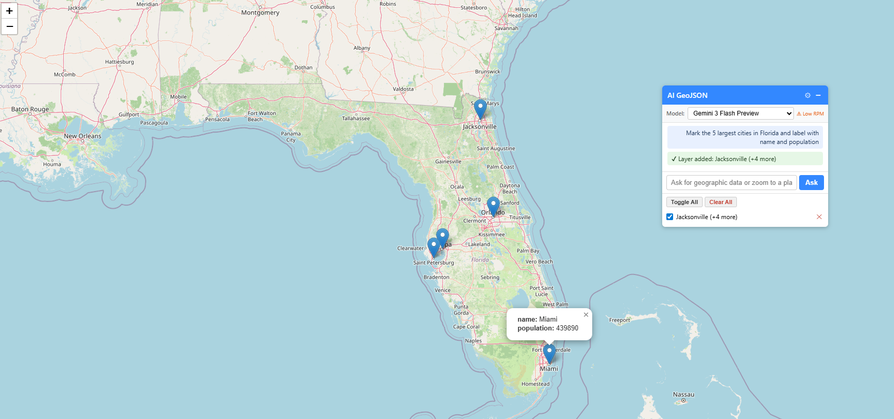

# Leaflet.AI.GeoJSON

A lightweight [Leaflet](https://leafletjs.com/) plugin that lets users query an LLM for geographic data and renders the result on the map as toggleable GeoJSON layers.

[](https://www.npmjs.com/package/leaflet.ai.geojson)
[](LICENSE)

## Features
- **Navigation queries** — "Zoom to Tokyo" pans the map without drawing anything
- **Layer management** — each query creates a named, toggleable layer; clear individually or all at once
- **Built-in chat UI** — collapsible panel with chat log, model picker, and settings

## Live Demo

**[https://ericdalnas.github.io/leaflet.ai.geoJson/examples/proxy-azure/demo.html](https://ericdalnas.github.io/leaflet.ai.geoJson/examples/proxy-azure/demo.html)**

Run the included Node proxy locally and point the demo at it, or deploy to Azure — see [Examples](#examples).

<p align="center">
  
</p>

## Installation

### Script tag

```html
<link rel="stylesheet" href="https://unpkg.com/leaflet.ai.geojson/dist/leaflet.ai.geojson.css" />
<script src="https://unpkg.com/leaflet.ai.geojson/dist/leaflet.ai.geojson.js"></script>
```

### npm

```bash
npm install leaflet.ai.geojson
```

```js
import 'leaflet.ai.geojson';
// or
require('leaflet.ai.geojson');
```

## Quick Start

```js
var map = L.map('map').setView([20, 0], 2);
L.tileLayer('https://{s}.tile.openstreetmap.org/{z}/{x}/{y}.png').addTo(map);

L.control.aiGeojson({
  proxyUrl:     '/llm',
  modelListUrl: '/models',
  modelPicker:  true,
  model:        'gemini-2.0-flash'
}).addTo(map);
```

The plugin always routes requests through a backend proxy. See [Examples](#examples) for a ready-to-run Node proxy. See [Production Checklist](#production-checklist) before exposing any proxy to the internet.

## Examples

> **These examples are for development only.** Neither proxy is production-ready out of the box. Before exposing any proxy to the internet, read [Production Checklist](#production-checklist) below.

| Folder | What it is |
|---|---|
| [`examples/proxy-node`](examples/proxy-node) | Local Express proxy. API key lives in `.env` on your machine. Binds to `127.0.0.1` — not reachable from the network. Start here for local development. |
| [`examples/proxy-azure`](examples/proxy-azure) | Azure App Service deployment with CORS, per-IP rate limiting, and an optional shared-secret auth header. A better starting point for a real deployment. |

## Production Checklist

> **Disclaimer:** This checklist is a starting point, not a complete or authoritative security guide. Every deployment has different risk, compliance, and infrastructure requirements. Consult the [OWASP API Security Top 10](https://owasp.org/API-Security/editions/2023/en/0x00-header/) and your AI provider's own security documentation ([Google AI](https://ai.google.dev/gemini-api/docs/safety-guidance), [OpenAI](https://platform.openai.com/docs/guides/safety-best-practices)) before any production deployment. When in doubt, engage a qualified security professional.

Every LLM proxy that's reachable from the internet needs the following. Skipping any one of them can result in runaway API costs or abuse.

### 1. Authentication — who is allowed to call your proxy?

Because this plugin runs in the browser, every request it makes — including the proxy URL and any headers — is visible in the browser's network inspector. Anyone who can load your page can see and replay those requests. This is a fundamental constraint of browser-based plugins, not a bug.

**What this means in practice:**

- **For static or demo sites (no user accounts):** You cannot fully prevent a determined person from reusing your proxy endpoint. Your real defenses are rate limiting and spend caps (see below). CORS helps block casual cross-site abuse from other browser pages but does not stop `curl` or scripts.
- **For apps with user accounts (dynamic sites):** You can genuinely restrict access. The proxy checks that the user is authenticated before forwarding requests. Options:
  - **Session cookie** — if your app has a login, validate the session on the proxy. Browsers send cookies automatically for same-origin requests; arbitrary callers won't have a valid session.
  - **Signed JWT / OAuth / OIDC** — your backend issues a short-lived token after login; the browser sends it as a `Bearer` header; the proxy verifies it before forwarding.
- **Shared secret header (`X-Auth-Key`)** — raises the bar slightly by obscuring the endpoint, but any secret sent from the browser can be extracted from network traffic. Treat it as a convenience for internal tools where users are trusted, not as real security. The Azure example supports this via the `AUTH_KEY` environment variable.

### 2. Rate limiting and spend caps — your real safety net

For static/demo sites especially, rate limiting and spend caps are your primary protection against runaway costs.

**Minimum viable limits:**
- Per-IP rate limit (both example proxies include this — tune `RATE_LIMIT_RPM`)
- Per-authenticated-user limit if you have auth
- **Set a spend cap on your API key in the provider's dashboard** — this is the most important control regardless of everything else

### 3. Input validation — what can users ask?

- Enforce a **maximum request body size** (both examples already limit to 32 KB)
- Consider a **prompt content policy** if your app is public (e.g. block requests that look like jailbreak attempts)
- Validate the `model` field against an allowlist so users can't force expensive models

### 4. HTTPS and origin control

- Always serve the proxy over **HTTPS** — never plain HTTP in production
- Set a strict **CORS origin** to your domain, not `*` (the Azure example supports `ALLOWED_ORIGIN`)
- The Node example blocks [DNS rebinding attacks](https://en.wikipedia.org/wiki/DNS_rebinding) by rejecting requests whose `Host` header isn't `localhost`; replace this with an origin allowlist in production

### 5. Key hygiene

- Store the API key in an **environment variable or secrets manager** — never in source code
- Use a **separate key per environment** (dev / staging / prod) so you can revoke one without affecting others
- Set a **spend cap** on each key at the provider level

## Options

### Connection

| Option | Type | Default | Description |
|---|---|---|---|
| `proxyUrl` | `String` | `null` | **Required.** URL of a same-origin backend that holds your API key. The plugin POSTs `{message, systemPrompt, model, temperature, maxTokens}` and expects `{text}` back. |
| `model` | `String` | `'gemini-2.0-flash'` | Model identifier |

### Prompt

| Option | Type | Default | Description |
|---|---|---|---|
| `systemPrompt` | `String` | *(auto)* | System prompt prepended to every request. Auto-generated from `maxPolygonCoordinates` if omitted. |
| `maxTokens` | `Number` | `8192` | Max output tokens per request |
| `temperature` | `Number` | `0.2` | Model temperature (0�1). Keep low for geographic data. |
| `maxPolygonCoordinates` | `Number` | `50` | Max coordinate pairs per polygon ring. Increase for detail; decrease for speed. |

### Styling

| Option | Type | Default | Description |
|---|---|---|---|
| `style` | `Object` | `{ color: '#3388ff', weight: 2, opacity: 0.8, fillOpacity: 0.25 }` | Base path style for all vector features |
| `polygonStyle` | `Object` | `null` | Style overrides for polygons |
| `lineStyle` | `Object` | `null` | Style overrides for lines |
| `pointStyle` | `String` | `'marker'` | `'marker'` or `'circle'` |
| `pointRadius` | `Number` | `6` | Circle marker radius in pixels |
| `markerOptions` | `Object` | `{}` | Options passed to `L.marker()` for point features |
| `popups` | `Boolean` | `true` | Bind a property popup to each feature |

### UI

| Option | Type | Default | Description |
|---|---|---|---|
| `position` | `String` | `'topright'` | Leaflet control position |
| `title` | `String` | `'AI GeoJSON'` | Control panel title |
| `buttonText` | `String` | `'Ask'` | Submit button label |
| `placeholder` | `String` | `'Ask for geographic data or zoom to a place�'` | Input placeholder |
| `modelPicker` | `Boolean` | `false` | Show a model-selector dropdown. Requires `modelListUrl`. |
| `modelListUrl` | `String` | `null` | URL returning `[{id, name}]` for the model picker. The proxy must expose a GET endpoint in this format. |
| `settingsPanel` | `Boolean` | `false` | Show a gear icon that opens an editor for temperature, tokens, polygon detail, point style, and popups |

## API

### `L.control.aiGeojson(options)`

Creates the control. Add to a map with `.addTo(map)`.

### `.query(text)`

Programmatically send a query. Returns a `Promise`.

- Resolves with `{ id, title, geojson }` for a GeoJSON result
- Resolves with `{ type: 'zoom', name }` for a navigation query
- Rejects with an `Error` on failure

```js
control.query('Show the countries of West Africa').then(function (result) {
  console.log(result.title, result.geojson);
});
```

### `.toggleLayer(id, visible?)` / `.toggleAll(visible?)`

Toggle a single layer or all layers. Omit `visible` to flip the current state.

### `.removeLayer(id)` / `.clearAll()`

Remove one layer or all layers.

## Static Utilities

### `L.Control.AiGeojson.isPreviewModel(id)`

Returns `true` if the model ID looks like a preview or experimental build.

## License

MIT
